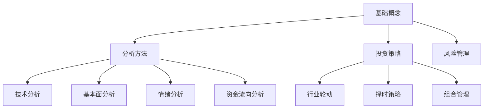

---
tags:
  - mOC
  - 投资/知识体系
---

# 投资知识体系

> 本目录存放金融投资的理论知识，为投资分析框架提供理论支撑。

---

## 定位

**⚠️ 核心原则：知识体系独立于项目，只记录通用的理论知识，不包含项目特定的实现细节。**

**⚠️ 技术约束：算力有限，不涉及机器学习相关内容（量化模型、ML 预测、深度学习等）。相关笔记仅供了解原理，不进行 API 调研或开发。**

**知识体系 vs 分析框架**

| 维度 | 知识体系 | 分析框架 |
|------|----------|----------|
| 内容 | 概念、定义、公式、机制 | 方法、流程、决策逻辑 |
| 性质 | 客观、稳定 | 主观、可迭代 |
| 变化频率 | 低 | 高 |
| 作用 | 提供理论支撑 | 指导 skill 开发 |
| 示例 | "什么是 PE，怎么算" | "PE 低于 15 时关注" |
| 项目相关性 | 无 | 与 OpenClaw-Alpha 强相关 |

---

## 知识地图



---

## 核心笔记

### 基础概念
- [[估值指标]] - PE/PB/PS/PCF
- [[DCF估值法]] - 现金流折现/FCFF/FCFE/WACC/终值计算/敏感性分析
- [[行业估值方法]] - 不同行业估值特点/DCF/PEG/EV-EBITDA
- [[财务指标]] - ROE/ROA/毛利率
- [[市场指标]] - 换手率/量比/振幅
- [[市场微结构与交易成本]] - 买卖价差/冲击成本/流动性度量/执行算法
- [[可转债分析]] - 转股溢价率/纯债价值/双低策略/条款博弈
- [[资本资产定价模型]] - CAPM/贝塔系数/系统性风险/必要报酬率
- [[套利定价理论]] - APT/多因子资产定价模型/与CAPM对比
- [[有效市场假说]] - EMH/弱式/半强式/强式效率/A股市场有效性

### 分析方法
- [[经济周期理论]] - 康波/朱格拉/基钦/库兹涅茨周期/周期嵌套/美林时钟
- [[宏观经济分析]] - 经济周期/政策分析/宏观指标
- [[宏观拐点识别]] - 领先指标/信用底-市场底-经济底/周期定位
- [[信用周期]] - 社融/信贷脉冲/信用拐点/资产配置
- [[技术分析]] - 均线/形态/指标
- [[多指标组合策略]] - 指标组合/共振信号/参数优化
- [[技术指标参数优化]] - 参数调优/网格搜索/Walk-Forward
- [[基本面分析]] - 财报/估值
- [[情绪分析]] - 资金流向/期权/A股综合情绪指数
- [[舆情分析]] - NLP情感分析/舆情指标/情感指数
- [[行为金融学]] - 认知偏差/市场异象/前景理论
- [[波动率分析]] - 历史波动率/隐含波动率/风险管理/期权定价
- [[恐慌指数]] - VIX 计算方法/解读/A股应用
- [[市场宽度指标]] - ADL/TRIN/McClellan/背离判断
- [[资金流向分析]] - 北向资金/主力资金/板块资金
- [[北向资金风格]] - 外资投资特征/持仓偏好/买卖时机
- [[绩效评估指标]] - 夏普比率/信息比率/索提诺比率/卡玛比率
- [[龙虎榜与游资]] - 游资操作手法/识别方法/信号解读
- [[大宗交易分析]] - 折溢价解读/席位分析/信号识别
- [[游资量化识别与风格画像]] - 知名游资席位/量化指标/行为模式
- [[机构持仓追踪]] - 公募/社保/QFII 持仓变动/信号解读
- [[融资融券分析]] - 杠杆资金/两融余额/强制平仓风险
- [[期权分析]] - PCR/隐含波动率/期权情绪
- [[期权希腊字母与定价模型]] - Delta/Gamma/Theta/Vega/Black-Scholes
- [[期权策略组合]] - 价差策略/跨式组合/备兑看涨/领口策略
- [[行业景气度]] - 景气指数/扩散指数/驱动力筛选/前瞻方法
- [[景气度指标构建方法]] - 标准化处理/权重确定/量价库存体系/回测验证
- [[库存周期]] - 基钦周期/四阶段/量价库存/周期定位
- [[利率周期与资产配置]] - 收益率曲线/期限结构/周期定位/股债配置
- [[分析师预期]] - 一致预期/预期修正/前瞻信号
- [[产业链分析]] - 上下游结构/价格传导/利润分配/链式投资
- [[新能源汽车行业景气度追踪]] - NEV产业链/景气度指标/追踪方法
- [[半导体行业景气度追踪]] - 硅周期/库存周期/产能追踪/国产替代
- [[医药行业景气度追踪]] - 集采影响/创新药管线/CXO订单/细分赛道
- [[消费行业景气度追踪]] - 白酒/家电/调味品/化妆品/渠道动销
- [[军工行业景气度追踪]] - 国防预算/订单周期/航空发动机/导弹/军工电子
- [[相对强度]] - 个股/板块相对表现/曼斯菲尔德RS/温斯坦阶段分析
- [[盈利质量分析]] - 利润真实性/现金含量/财务造假识别/红旗指标

### 投资策略
- [[资产配置理论]] - 战略性/战术性配置/资产类别/再平衡/A股应用
- [[行业轮动]] - 景气度/趋势/拥挤度
- [[风格轮动]] - 价值成长/大小盘/轮动信号/A股特征
- [[题材炒作理论]] - 题材生命周期/启动发酵高潮分歧退潮/龙头识别
- [[情绪周期理论]] - 市场情绪四阶段/发酵期上升期退潮期混沌期/仓位管理
- [[价值投资]] - 安全边际/内在价值/价值陷阱/A股应用
- [[均值回归]] - 统计原理/量化检验/交易策略/风险
- [[趋势跟踪]] - 动量效应/趋势识别/右侧交易/危机Alpha
- [[周期股投资]] - 资源/金融/地产/汽车/估值陷阱/买卖信号
- [[逆向投资策略]] - 极端估值/情绪极值/均值回归
- [[对冲策略]] - 市场中性/Beta中性/配对交易/期权对冲
- [[宏观对冲策略]] - 全天候策略/风险平价/债务周期/A股应用
- [[红利投资策略]] - 高股息/红利+低波/高股息陷阱/分红可持续性
- [[美林投资时钟]] - 经济周期/四阶段/资产轮动
- [[择时策略]] - 左侧/右侧/情绪分区
- [[组合管理]] - 分散/再平衡/风险平价
- [[有效前沿]] - 均值方差模型/马科维茨/两基金分离定理
- [[组合优化约束]] - 持仓约束/换手约束/基数约束/因子暴露约束
- [[风险平价]] - Risk Parity/等风险贡献/All Weather
- [[风险预算]] - Risk Budgeting/风险分配/逐级分解/动态再平衡
- [[Black-Litterman模型]] - 市场均衡/主观观点/贝叶斯更新
- [[Fama-French因子模型]] - FF3/FF5/FF6 模型演进/因子构造/A股应用
- [[多因子模型]] - Barra 模型/因子暴露/风险分解
- [[量化因子]] - 规模/价值/动量/质量/红利
- [[因子有效性检验]] - IC/IR/分层检验/回归法
- [[因子择时]] - 因子动量/宏观对冲/估值择时/拥挤度择时/多信号融合
- [[因子轮动]] - 价值成长轮动/大小盘轮动/轮动信号/策略类型
- [[因子拥挤度]] - 拥挤度量指标/因子崩溃/风险管理/A股特点
- [[智能定投]] - 估值驱动/情绪驱动/趋势驱动
- [[短线交易体系]] - 情绪周期/题材分析/龙头识别/买卖策略
- [[管理期货策略]] - CTA/趋势跟踪/危机Alpha
- [[统计套利]] - 配对交易/协整检验/市场中性/A股应用
- [[商品周期与通胀对冲]] - 超级周期/库存周期/通胀传导/A股应用
- [[事件驱动策略]] - 并购套利/特殊情况/信用事件/A股特色
- [[ETF套利策略]] - 瞬间套利/延时套利/事件套利/期现套利
- [[信号与回测]] - 信号生成/回测框架/绩效评估
- [[多信号融合与权重优化]] - 等权/IC加权/IR加权/均值方差/风险平价/信号相关性
- [[蒙特卡洛模拟]] - 随机抽样/VaR计算/期权定价/组合风险分析
- [[机器学习与量化投资]] - 因子挖掘/非线性组合/树模型/过拟合防控

### 风险管理
- [[风险管理]] - 风险类型/风险评估/控制流程
- [[投资决策检查清单]] - 买入/卖出/持仓管理标准化检查流程
- [[仓位管理]] - 金字塔/倒金字塔
- [[凯利公式与最优仓位]] - Kelly Criterion/分数凯利/仓位优化
- [[止损策略]] - 固定/移动/AI 追踪
- [[分散投资]] - 行业/市值/风格
- [[量化风险度量]] - VaR/CVaR
- [[风险价值]] - VaR计算/参数法/历史模拟/蒙特卡洛
- [[回撤分析]] - 回撤深度/持续时间/恢复时间/心理阶段
- [[压力测试]] - 历史情景/假设情景/反向压力测试
- [[波动率估计]] - 历史波动率/EWMA/GARCH
- [[波动率目标策略]] - Volatility Targeting/动态杠杆/风险平准
- [[因子协方差矩阵估计]] - Ledoit-Wolf收缩/Newey-West/Eigenfactor/DCC-GARCH
- [[相关性风险]] - 危机传染/分散化失效/尾部依赖
- [[Copula与尾部依赖]] - Skklar定理/尾部依赖系数/Copula类型选择/风险管理应用
- [[动量崩溃风险]] - 动量因子在市场反转时的巨大亏损/应对策略
- [[回测陷阱与偏差]] - 前视偏差/幸存者偏差/过拟合/交易成本低估
- [[价值陷阱]] - 低估值但基本面恶化/识别信号/量化筛选/避免策略
- [[组合保险策略]] - CPPI/OBPI/保本策略/下行保护

---

## 编写规范

### Frontmatter

```yaml
---
tags:
  - 投资/知识体系
  - 投资/知识体系/子分类
aliases:
  - 别名1
  - 别名2
---
```

### 内容结构

```markdown
# 概念名称

## 定义
<!-- 一句话定义 -->

## 公式
<!-- 计算公式（如有） -->

## 应用场景
<!-- 什么时候用，怎么用 -->

## 注意事项
<!-- 陷阱、局限性 -->

## 相关概念
- [[相关概念1]]
- [[相关概念2]]
```

### 编写原则

1. **客观准确** - 只记录公认的理论知识
2. **结构清晰** - 概念 → 公式 → 应用场景
3. **简明扼要** - 不冗余，可快速查阅
4. **双向链接** - 关联概念用 `[[wikilinks]]`

---

## 与框架的关系

```
知识体系（理论底座）
    ↓ 指导
分析框架（实践方法）
    ↓ 指导
Skill 开发（具体实现）
```

**示例**：
- 知识体系：[[估值指标#PE]] 的定义、公式、适用场景
- 分析框架：PE 低于行业均值 20% 作为筛选条件
- Skill 实现：`stock_screener` 的 `--pe-max` 参数
