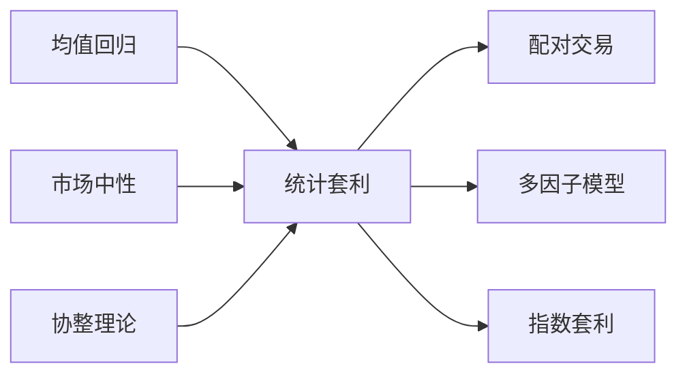

---
tags:
  - 投资/知识体系
  - 投资/知识体系/投资策略
aliases:
  - Stat Arb
  - Stat Arb策略
  - 配对交易
---

# 统计套利

## 定义

统计套利（Statistical Arbitrage，简称 Stat Arb）是一类基于均值回归分析的量化交易策略，通过数学模型识别证券之间的定价偏差，同时建立多头和空头头寸，在价格回归均衡时获利。

**核心特点**：
- **市场中性**：同时持有多空仓位，降低 Beta 暴露
- **均值回归**：假设价格偏离会回归历史关系
- **高频执行**：利用算法捕捉短暂定价偏差

---

## 策略类型

### 1. 配对交易（Pairs Trading）

最简单的统计套利形式，同时交易两只高度相关的证券。

**原理**：
- 找到两只历史相关性高的股票（相关系数 ≥ 0.80）
- 当两者价格关系偏离历史均值时建仓
- 价格回归时平仓获利

**示例**：
| 股票 | 关系 | 操作 |
|------|------|------|
| 可口可乐 | 相对低估 | 做多 |
| 百事可乐 | 相对高估 | 做空 |

**利润来源**：
- 低估股票价格上涨
- 高估股票价格下跌
- 两者价格收敛

### 2. 多因子统计套利

扩展到多只股票，使用因子模型构建投资组合。

**步骤**：
1. 因子暴露：计算股票对各因子（行业、风格等）的暴露
2. 收益预测：基于因子预测股票收益
3. 组合优化：构建市场中性组合
4. 执行交易：做多预期跑赢，做空预期跑输

### 3. 指数套利

利用指数成分股与指数期货/ETF 之间的定价偏差。

---

## 协整检验

**协整（Cointegration）** 是统计套利的数学基础，用于判断两个时间序列是否存在长期均衡关系。

### 相关性 vs 协整

| 概念 | 含义 | 适用场景 |
|------|------|----------|
| 相关性 | 两序列同步变动程度 | 短期关系 |
| 协整 | 两序列长期均衡关系 | 均值回归策略 |

**关键区别**：
- 高相关性 ≠ 协整（可能只是短期同步）
- 协整意味着长期会回归均衡

### 检验方法

#### 1. Engle-Granger 两步法

**步骤**：
1. 对两个价格序列做线性回归
2. 对残差做 ADF 检验（单位根检验）
3. 残差平稳 → 存在协整关系

**局限**：
- 只能检测一个协整关系
- 多变量时可能遗漏

#### 2. Johansen 检验

**优势**：
- 可检测多个协整关系
- 适用于多变量系统

**两种形式**：
- Trace 检验：检验协整关系数量
- 最大特征值检验：检验最强协整关系

#### 3. Phillips-Ouliaris 检验

对残差做更稳健的平稳性检验。

---

## 交易信号

### 价差计算

对于协整的两只股票 A 和 B：

$$Spread_t = P_{A,t} - \beta \times P_{B,t}$$

其中 β 是对冲比率（ hedge ratio）。

### Z-Score 信号

$$Z_t = \frac{Spread_t - \mu}{\sigma}$$

**交易规则**：

| Z-Score | 信号 | 操作 |
|---------|------|------|
| Z > 2 | 价差异常高 | 做空 A，做多 B |
| Z < -2 | 价差异常低 | 做多 A，做空 B |
| \|Z\| < 0.5 | 价差回归 | 平仓 |

### 参数选择

| 参数 | 说明 | 典型值 |
|------|------|--------|
| 回望窗口 | 计算均值/标准差的周期 | 20-60 天 |
| 开仓阈值 | Z-Score 触发交易 | ±2.0 |
| 平仓阈值 | Z-Score 平仓位置 | ±0.5 |
| 止损阈值 | Z-Score 止损位置 | ±4.0 |

---

## 风险

### 1. 协整关系破裂

**原因**：
- 公司基本面发生重大变化
- 行业格局改变
- 并购重组

**后果**：价格不再回归，持续亏损

### 2. 执行风险

- 高频交易依赖低延迟
- 滑点侵蚀利润
- 做空成本（融券费率）

### 3. 模型风险

- 过拟合历史数据
- 参数敏感
- 市场结构变化

### 4. 尾部风险

- 极端行情下相关性失效
- 流动性枯竭
- 2008 年危机时多数量化策略崩溃

---

## A 股应用

### 特殊性

| 特点 | 影响 |
|------|------|
| T+1 制度 | 无法日内回转，降低灵活性 |
| 涨跌停限制 | 可能无法及时建仓/平仓 |
| 融券限制 | 做空成本高，券源有限 |
| 散户占比高 | 价格偏离可能持续更久 |
| 行业联动强 | 同行业股票协整机会多 |

### 适用策略

| 策略 | A 股适用性 | 说明 |
|------|-----------|------|
| 行业内配对 | ✅ 高 | 同行业龙头配对 |
| A+H 配对 | ✅ 高 | AH 股价差套利 |
| ETF 套利 | ✅ 高 | 一二级市场套利 |
| 跨市场配对 | ⚠️ 中 | A 股 + 港股/美股 |
| 高频统计套利 | ❌ 低 | T+1 限制 |

### 实践建议

1. **选股范围**：聚焦流动性好、可融券的标的
2. **协整检验**：滚动窗口检验，及时剔除失效配对
3. **止损严格**：协整破裂时果断止损
4. **分散投资**：同时持有多组配对，降低单一风险

---

## 与其他策略的关系

---

## 相关概念

- [[风险管理]] - 市场中性策略的风险控制
- [[量化因子]] - 多因子统计套利的因子选择
- [[回测陷阱与偏差]] - 统计套利回测的常见陷阱
- [[市场微结构与交易成本]] - 执行成本对策略收益的影响
- [[相关性风险]] - 协整关系失效的风险
